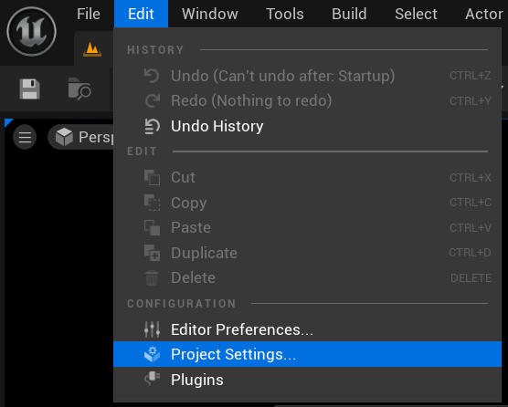

# cgt545_02_TEMPLATE

Developed with Unreal Engine 5.3

Intructions for adding Git Large File Storage:

- download Github Desktop
- download Git Large File System
- clone the repository using the github desktop option
- when cloning change the folder name to cgt545_02_[YOUR PURDUE USER NAME]

When you first open up the project in unreal, change your project settings

Change the project name and description. 

Then change the name of the cgt545_02_TEMPLATE file to be cgt545_02_[YOUR PURDUE USER NAME] replacing [YOUR PURDUE USERNAME] obviously.

** BakedLighting_Lightmaps_House2 is under Content/Fundamentals/Lighting_Rendering/ **

